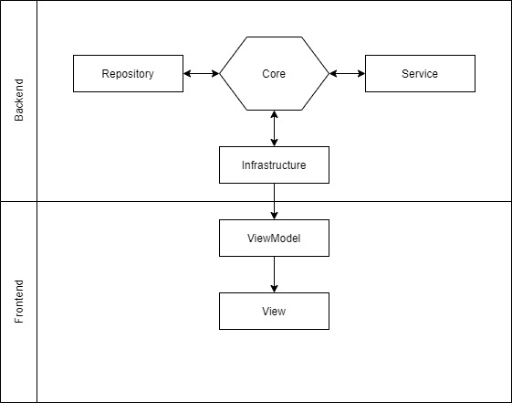
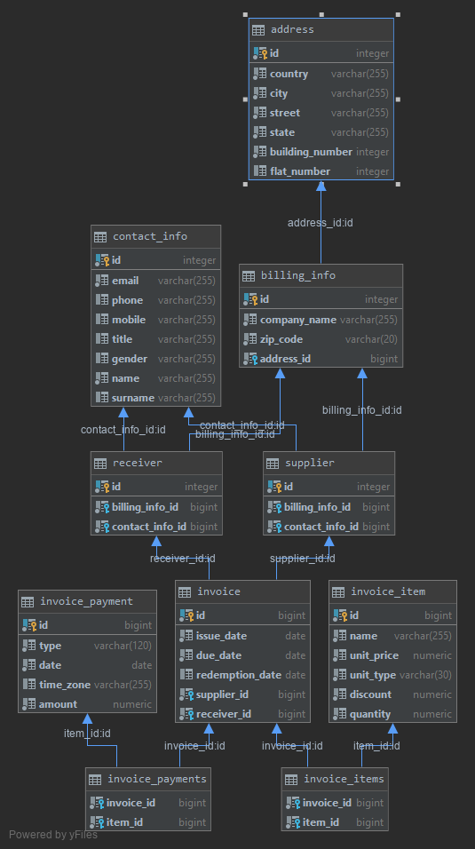

# InvoiceManagementStudio

## Compilation prerequisite

Requires PostgreSQL database:

- [dll](./Documentation/Script/Db/db_schema.sql),
- [test data](./Documentation/Script/Db/db_data.sql)

<<<<<<< HEAD
=======
Database configuration in file: [App.config](./InvoiceManagementStudio/App.config).

>>>>>>> develop
## Background

`IVMS` was created as a term project at university `Wyższa Szkoła Ekonomii i Informatyki w Krakowie` as a subject of `Programming in C#` labs.

## Requirements

- `C#` - Programing language.
- `WPF` - Desktop application.
- `GitHub` - Project VC.
- `Team` - Of 2 or more.

## Short Description

`Invoice Management Studio` is a simple desktop application created to manage invoices. Provides simple CRUD operations on its resources and local persistance in database.

## Technologies used

We aimed to use as few frameworks and libraries as possible to grasp as mutch of vanilla C# as possible.

- `C#`,
- `WPF`.
- `Postgresql` database,
- `Npgsql` - As connection and operation library for managing PostgreSQL database.

## Application architecture

To keep our code clean and well organized we spend quite a lot of time designing application architecture.

We used `Hexagonal architecture` to separate different layers of logic.

### `Core`

An application root and definition, provides:

- domain objects shared between different layers,
- component intefaces, providing abstract communication api between layers.

By using this approach we can simplify project structure in a way that `Service` layer does not know about existence of `Repository` layer. It only knows of abstract interface provided by `Core`. Thanks to that if we ever decide to replace repository managing postgresql database, and use xml files instead we do not have to change any of `Service` layer logic, as it only uses abstractions provided in `Core`.

### `Repository`

It is a layer responsible for management and communication with `PostgreSQL` database.

1. `Entity` objects
    - provide definition of application resources mapped to simple type representing data stored in database row,
    - any relations to another objects are mapped into their id,
    - enum values are mapped into strings,
    - `FromDomain` creates `entity` representing a database row from a domain object.
    - `ToDomain` a method that supplied with object relations can create a domain obejct out of entity.

2. `RowMapper`
   - Classes responsible of translating database query result set into an `entity` object.

3. `Command`
   - Responsible of managing and executing query upon a database connection.

4. `Repository`
   - Layer communication access point. Provides methods on resources and delegates tasks to database.

### `Service`

It is a layer concluding application business logic. Gives access to resources, and delegates user action results to specific logic engines.

### `Infrastructure`

And application context and dependency provider. Presumably an `IoC` container with `Dependency Injection` factory. Depends on time we will be able to dedicate into project.

### `ViewModel`

Manages and binds application domain objects with Desktop application view.

### `View`

Provides graphical desktop interface to user.

## Resources

- `Invoice` - application root aggregate. Represents an invoice in system with all related data.
- `Invoice Item` - Subject of invoice.
- `Invoice Payment` - Way invoice was payed off.
- `Supplier` - Company issuing an invoice.
- `Receiver` - To whom invoice is issued.
- `Contact Info` - Data representing a person to contact with about invoice.
- `Billing Info` - Company data needed to issue a invoice.
- `Address` - Physical address of invoice receiver.
